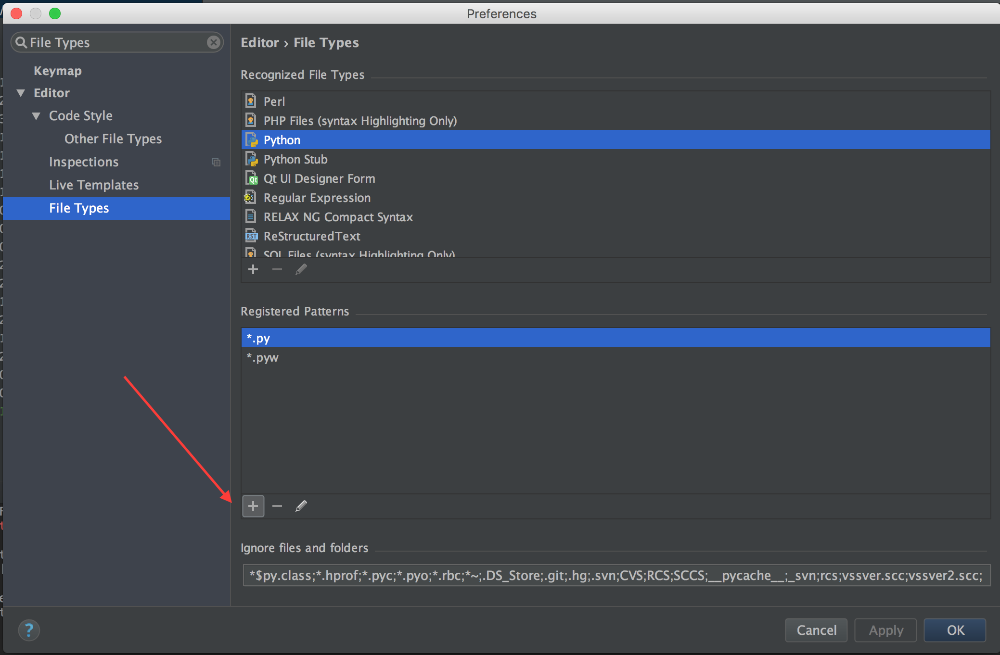

PyCharm Live Templates
----------------------------------------------------

:date: 2017-03-18 09:08
:modified: 2017-03-18 09:08
:category: Blog
:tags: Pycharm
:slug: pycharm-live-templates
:authors: Bryan Price
:summary: I discuss PyCharm's Live Templates functionality and Code Templates.

So recently I've found myself writing a lot of repetitive code. First of all I have to write python toolboxes for work.
A python toolbox is a python file with the extension .pyt. It is used in ESRI's ArcMap and ArcCatalog programs.
When writing a python toolbox file in PyCharm, it's best to start with a skeleton template because the toolbox must
adhere to a given format.

Before we create the template, I would advise setting PyCharm to recognize the file extension .pyt as a python file.
To do this go to the File->Settings on Windows or PyCharm->Preferences on macOS.
Search for file types in the search bar in the upper left hand corner and add *.pyt under the Python group.

