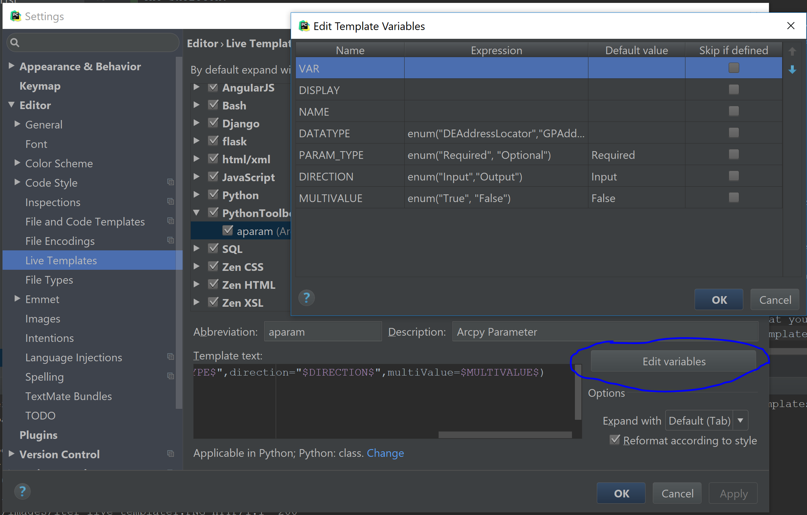

PyCharm Live Templates
######################

:date: 2018-05-05 09:08
:modified: 2017-03-18 09:08
:category: Blog
:tags: Pycharm
:slug: pycharm-live-templates
:authors: Bryan Price
:summary: I discuss PyCharm's Live Templates functionality and Code Templates.

So sometime last year I found myself writing a lot of repetitive code. First of all, I have to write python toolboxes for work.
A python toolbox is a python file with the extension .pyt. It is used in ESRI's ArcMap and ArcCatalog programs.
When writing a python toolbox file in PyCharm, it's best to start with a skeleton template because the toolbox must
adhere to a given format.

Before we create the template, I would advise setting PyCharm to recognize the file extension .pyt as a python file.
To do this go to the File->Settings on Windows or PyCharm->Preferences on macOS.
Search for file types in the search bar in the upper left hand corner and add \*.pyt under the Python group.

.. image:: images/new_file_type.png
           :width: 100%

Now go to Settings->Editor->File and Code Templates and create your PythonToolbox template with the extension pyt.

.. image:: images/pyt_code_template.png
           :width: 100%

Here is the code to paste into the template.

.. code-block:: python

    import arcpy

    class Toolbox(object):
        def __init__(self):
            """Define the toolbox (the name of the toolbox is the name of the
            .pyt file)."""
            self.label = "Toolbox"
            self.alias = ""

            # List of tool classes associated with this toolbox
            self.tools = [Tool]

    class Tool(object):
        def __init__(self):
            """Define the tool (tool name is the name of the class)."""
            self.label = "Tool"
            self.description = ""
            self.canRunInBackground = False

        def getParameterInfo(self):
            """Define parameter definitions"""
            params = None
            return params

        def isLicensed(self):
            """Set whether tool is licensed to execute."""
            return True

        def updateParameters(self, parameters):
            """Modify the values and properties of parameters before internal
            validation is performed.  This method is called whenever a parameter
            has been changed."""
            return

        def updateMessages(self, parameters):
            """Modify the messages created by internal validation for each tool
            parameter.  This method is called after internal validation."""
            return

        def execute(self, parameters, messages):
            """The source code of the tool."""
            return

Now you can create a new file and PythonToolbox is an option. When you create the new file it will have this text as
the skeleton.

Something else that I found useful is PyCharm's live templates. Live templates give the ability to type a few letters,
hit tab and then fill out some code. If you have PyCharm give it a try, just type iter then press tab in a python file.
You should see something like this:

Hit tab and you will see this

You can then fill out the template by typing in variable names and hitting tab to go to the next place in the template.

So now that you know what a live template is, wouldn't it be handy to make your own? We are going to make a live template
for python toolboxes to make it easier to fill in arcpy.Parameter values. First, let's make a Live Template Group to organize
all of our PythonToolbox live templates.
You can do this by going to Settigns->Editor->Live Template and clicking the red plus on the right hand side and choosing to create a new group.
I aptly named my group PythonToolbox.

Next create a new live template in the group. You will be asked for an abbreviation (this is what you will type to be auto-completed like iter from my previous example).
You will also be asked for a description to explain what it is, and then you will create the template.

I set my abbreviation up as "aparam" with the description of "Arcpy Parameter". I used this as the template:

::

    $VAR$ = arcpy.Parameter(displayName="$DISPLAY$",name="$NAME$",datatype="$DATATYPE$",parameterType="$PARAM_TYPE$",direction="$DIRECTION$",multiValue=$MULTIVALUE$)

If you notice, everything with $ surrounding it is a variable.  If you choose "Edit Variable" you can set valid values for each variable (using enum) and a default value.

Before you save the template make sure you set where the template is applicable. In the image above you should see a "Change" button near the bottom.
When you are first creating the template you will get a warning that there are not contexts currently setup and the button will read "Define". I chose to make this template show up in python classes, and other (so anywhere in a python file).

One last thing: If you want to share a live template you can right click it and choose "copy". Someone else can just paste in the value into their IDE.

So here is the live template that I created.

::

    <template name="aparam" value="$VAR$ = arcpy.Parameter(displayName=&quot;$DISPLAY$&quot;,name=&quot;$NAME$&quot;,datatype=&quot;$DATATYPE$&quot;,parameterType=&quot;$PARAM_TYPE$&quot;,direction=&quot;$DIRECTION$&quot;,multiValue=$MULTIVALUE$) " description="Arcpy Parameter" toReformat="true" toShortenFQNames="true">
      <variable name="VAR" expression="" defaultValue="" alwaysStopAt="true" />
      <variable name="DISPLAY" expression="" defaultValue="" alwaysStopAt="true" />
      <variable name="NAME" expression="" defaultValue="" alwaysStopAt="true" />
      <variable name="DATATYPE" expression="enum(&quot;DEAddressLocator&quot;,&quot;GPAddressLocatorStyle&quot;,&quot;analysis_cell_size&quot;,&quot;GPType&quot;,&quot;DEMapDocument&quot;,&quot;GPArealUnit&quot;,&quot;GPBoolean&quot;,&quot;DECadDrawingDataset&quot;,&quot;GPCalculatorExpression&quot;,&quot;DECatalogRoot&quot;,&quot;GPSACellSize&quot;,&quot;GPCellSizeXY&quot;,&quot;GPCompositeLayer&quot;,&quot;GPSAGDBEnvCompression&quot;,&quot;GPCoordinateSystem&quot;,&quot;DESpatialReferencesFolder&quot;,&quot;DECoverage&quot;,&quot;DECoverageFeatureClasses&quot;,&quot;DEType&quot;,&quot;GPDataFile&quot;,&quot;DERemoteDatabaseFolder&quot;,&quot;DEDatasetType&quot;,&quot;GPDate&quot;,&quot;DEDbaseTable&quot;,&quot;GP3DADecimate&quot;,&quot;DEDiskConnection&quot;,&quot;GPDouble&quot;,&quot;GPEncryptedString&quot;,&quot;GPEnvelope&quot;,&quot;GPEvaluationScale&quot;,&quot;GPExtent&quot;,&quot;GPSAExtractValues&quot;,&quot;DEFeatureClass&quot;,&quot;DEFeatureDataset&quot;,&quot;GPFeatureLayer&quot;,&quot;GPFeatureRecordSetLayer&quot;,&quot;Field&quot;,&quot;GPFieldInfo&quot;,&quot;GPFieldMapping&quot;,&quot;DEFile&quot;,&quot;DEFolder&quot;,&quot;GPRasterFormulated&quot;,&quot;GPSAFuzzyFunction&quot;,&quot;DEGeodatasetType&quot;,&quot;DEGeoDataServer&quot;,&quot;DEGeometricNetwork&quot;,&quot;GPGALayer&quot;,&quot;GPGASearchNeighborhood&quot;,&quot;GPGAValueTable&quot;,&quot;DEGlobeServer&quot;,&quot;DEGPServer&quot;,&quot;GPGraph&quot;,&quot;GPGraphDataTable&quot;,&quot;GPGroupLayer&quot;,&quot;GPSAHorizontalFactor&quot;,&quot;DEImageServer&quot;,&quot;Index&quot;,&quot;GPINFOExpression&quot;,&quot;GPArcInfoItem&quot;,&quot;DEArcInfoTable&quot;,&quot;DELasDataset&quot;,&quot;GPLasDatasetLayer&quot;,&quot;GPLayer&quot;,&quot;DELayer&quot;,&quot;GPLine&quot;,&quot;GPLinearUnit&quot;,&quot;GPLong&quot;,&quot;GPMDomain&quot;,&quot;DEMapServer&quot;,&quot;DEMosaicDataset&quot;,&quot;GPMosaicLayer&quot;,&quot;GPSANeighborhood&quot;,&quot;NAClassFieldMap&quot;,&quot;GPNAHierarchySettings&quot;,&quot;GPNALayer&quot;,&quot;DENetworkDataset&quot;,&quot;GPNetworkDatasetLayer&quot;,&quot;DECadastralFabric&quot;,&quot;GPCadastralFabricLayer&quot;,&quot;GPPoint&quot;,&quot;GPPolygon&quot;,&quot;DEPrjFile&quot;,&quot;GPSAGDBEnvPyramid&quot;,&quot;GPSARadius&quot;,&quot;GPRandomNumberGenerator&quot;,&quot;DERasterBand&quot;,&quot;GPRasterCalculatorExpression&quot;,&quot;DERasterCatalog&quot;,&quot;GPRasterCatalogLayer&quot;,&quot;GPRasterDataLayer&quot;,&quot;DERasterDataset&quot;,&quot;GPRasterLayer&quot;,&quot;GPSAGDBEnvStatistics&quot;,&quot;GPRasterBuilder&quot;,&quot;GPRecordSet&quot;,&quot;DERelationshipClass&quot;,&quot;GPSARemap&quot;,&quot;GPRouteMeasureEventProperties&quot;,&quot;DESchematicDataset&quot;,&quot;DESchematicDiagram&quot;,&quot;DESchematicFolder&quot;,&quot;GPSchematicLayer&quot;,&quot;GPSASemiVariogram&quot;,&quot;DEServerConnection&quot;,&quot;DEShapefile&quot;,&quot;GPSpatialReference&quot;,&quot;GPSQLExpression&quot;,&quot;GPString&quot;,&quot;GPStringHidden&quot;,&quot;DETable&quot;,&quot;GPTableView&quot;,&quot;GPTerrainLayer&quot;,&quot;DETextfile&quot;,&quot;GPSAGDBEnvTileSize&quot;,&quot;GPSATimeConfiguration&quot;,&quot;DETin&quot;,&quot;GPTinLayer&quot;,&quot;DETool&quot;,&quot;DEToolbox&quot;,&quot;GPSATopoFeatures&quot;,&quot;DETopology&quot;,&quot;GPTopologyLayer&quot;,&quot;GPValueTable&quot;,&quot;GPVariant&quot;,&quot;GPSAVerticalFactor&quot;,&quot;DEVPFCoverage&quot;,&quot;DEVPFTable&quot;,&quot;DEWCSCoverage&quot;,&quot;GPSAWeightedOverlayTable&quot;,&quot;GPSAWeightedSum&quot;,&quot;DEWMSMap&quot;,&quot;DEWorkspace&quot;,&quot;GPXYDomain&quot;,&quot;GPZDomain&quot;)" defaultValue="" alwaysStopAt="true" />
      <variable name="PARAM_TYPE" expression="enum(&quot;Required&quot;, &quot;Optional&quot;)" defaultValue="Required" alwaysStopAt="true" />
      <variable name="DIRECTION" expression="enum(&quot;Input&quot;,&quot;Output&quot;)" defaultValue="Input" alwaysStopAt="true" />
      <variable name="MULTIVALUE" expression="enum(&quot;True&quot;, &quot;False&quot;)" defaultValue="False" alwaysStopAt="true" />
      <context>
        <option name="Python" value="true" />
      </context>
    </template>

Enjoy!